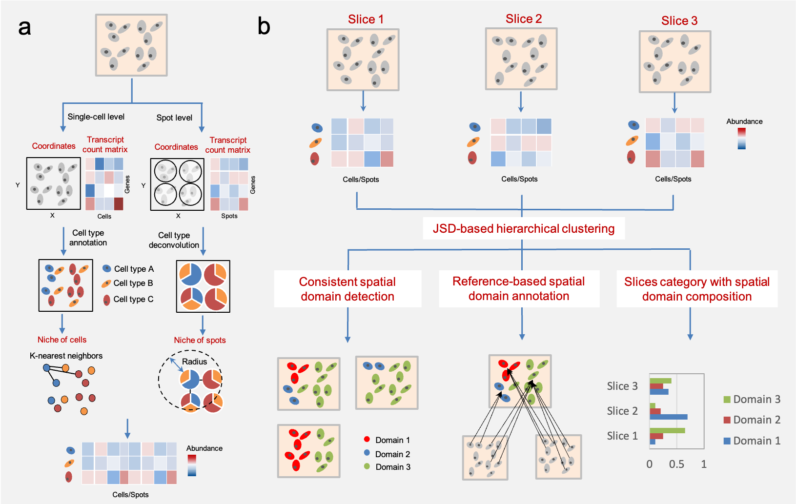

# SpatialAlign

## **Workflow of SpatialAlign** 
<!-- -->

## Overview
SpatialAlign is designed for multi-slice analysis of both single-cell resolution and spot-resolution spatial transcriptomics.

From the view of biological function, SpatialAlign uses a simple but effective strategy, spatially adjacent cell type distribution, to integrate gene expression and spatial information, that enables multi-slice analysis for both single-cell resolution and spot-resolution spatial transcriptomics from three aspects, namely consistent spatial domain detection, reference-based spatial domain annotation, and slice category with spatial domain composition.

## Getting started
See [Documentation and Tutorials](https://spatialalign.readthedocs.io/en/latest/index.html).

## Software dependencies
Seurat

## Installation

## Citation

